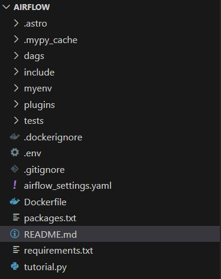
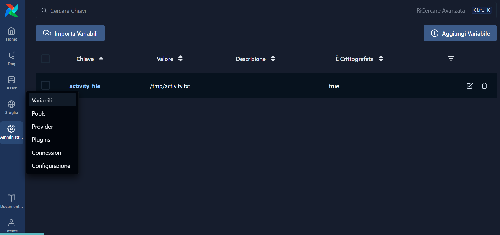
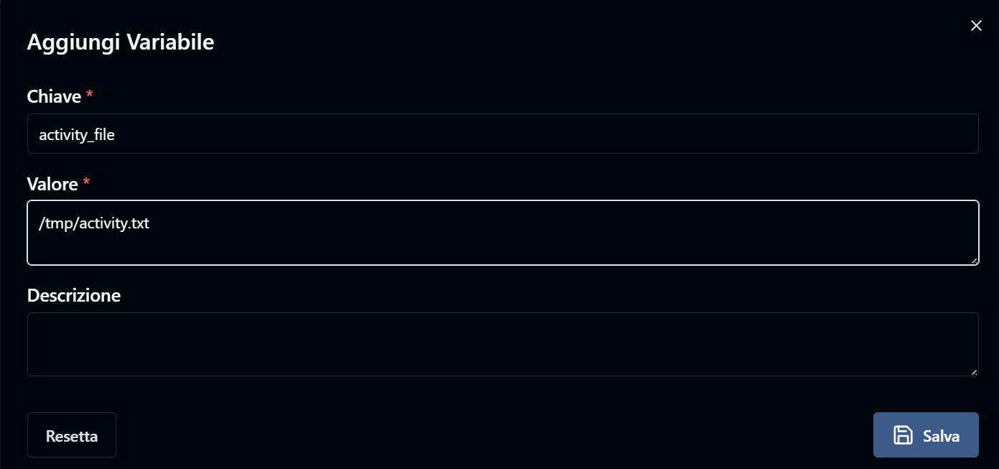
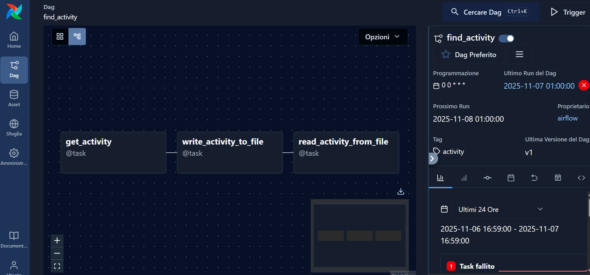

# Airflow tutorial

Sto seguendo un tutorial da Youtube, il video nello specifico è [questo](https://www.youtube.com/watch?v=xUKIL7zsjos).

Il primo passo quello di installare Astro CLI, un tool che semplifica la gestione di Airflow creando un ambiente di sviluppo locale.

Requisiti:
- Docker o Podman, un servizio di containerizzazione
- WSL (Windows Subsystem for Linux) se usi Windows

Vai al sito https://www.astronomer.io/docs/astro/cli/install-cli
e segui le istruzioni per il tuo sistema operativo.

Io ho seguito l'installazione manuale, scaricando da https://github.com/astronomer/astro-cli/releases la versione 1.36.0 per Windows.

Ho scaricato il file .exe e l'ho rinominato in astro.exe, poi l'ho spostato nella cartella C:\Program Files\Astro\
e ho aggiunto questa cartella al PATH di sistema.

Dopodiché ho aperto un terminale PowerShell e ho verificato l'installazione con il comando:

```powershell
astro version
```
Dovrebbe restituire la versione di Astro CLI installata.

Ora posso creare un nuovo progetto Airflow con il comando:

```powershell
astro dev init
```

Questo crea una serie di file e cartelle necessari per un progetto Airflow (vedi immagine sotto).




Ora:

- Creo un nuovo DAG (Directed Acyclic Graph) in `dags/` chiamato `find_activity,py`.
- Importo le librerie necessarie.
    ```python
    from airflow.decorators import dag
    from pendulum import datetime
    ```
- Definisco il DAG con il decoratore `@dag`, specificando `start_date`, `schedule`, `tags` e `catchup`.
    ```python
    @dag(
    start_date=datetime(2024, 1, 1),
    schedule='@daily',
    tags=['activity'],
    catchup=False
    )
    ```
    Cosa sono questi parametri?
    - `start_date`: la data in cui il dag inizia a essere eseguito.
    - `schedule`: la frequenza con cui il dag viene eseguito (in questo caso, ogni giorno).
    - `tags`: etichette per organizzare e filtrare i dag nell'interfaccia di Airflow.
    - `catchup`: se impostato su False, Airflow non eseguirà i dag non eseguiti in passato e rimasti indietro.
- Ora definisco il primo task: nell'esempio il task fa una richiesta a Bored API che restituisca un'attività random.
Per farlo uso il Python Operator. Due modi:
    1. Chiamando direttamente la funzione `PythonOperator`.
    2. Usando il decoratore `@task` (metodo preferito).
    
    Il primo task è get_activity e fa una richiesta GET a Bored API. Il return sarà salvato in XCom.

- Per vedere i task nell'interfaccia di Airflow, avvio l'ambiente di sviluppo con il comando:

    ```powershell
    astro dev start
    ```
    **NOTA**: prima di farlo assicurati che Docker o Podman siano in esecuzione.
    Altrimenti riceverai l'errore: <br>`ERROR: error during connect: in the default daemon configuration on Windows, the docker client must be run with elevated privileges to connect: Head "http://%2F%2F.%2Fpipe%2Fdocker_engine/_ping": open //./pipe/docker_engine: The system cannot find the file specified. Error: an error was encountered while building the image, see the build logs for details`
    Dopo qualche minuto, l'interfaccia di Airflow sarà accessibile all'indirizzo http://localhost:8080


- Ora creo un secondo task che inserisce l'attività trovata in un file di testo chiamato `activity_file`.
    Qui puoi notare l'uso di Variable. Le Variable in Airflow sono un modo per memorizzare e recuperare valori trasversali ai DAG e ai task.
    Prima di utilizzarla devo creare la Variable nell'interfaccia di Airflow:
    - Vado su Amministrazione -> Variabili

    

    - Aggiungi Variabile
    - Key: activity_file
    - Value: /tmp/activity.txt

    

- A questo punto aggiungo l'ultimo task e designo le dipendenze tra i task con l'operatore `>>`.
- Salvo il file e ricarico l'interfaccia di Airflow per vedere il nuovo DAG.
- Attivo il DAG spuntando l'interruttore a destra del nome del DAG.



- Alla prima run mi da errore, perchè la l'API di Bored è momentaneamente non raggiungibile.
Utilizzo quindi https://bored-api.appbrewery.com/random
